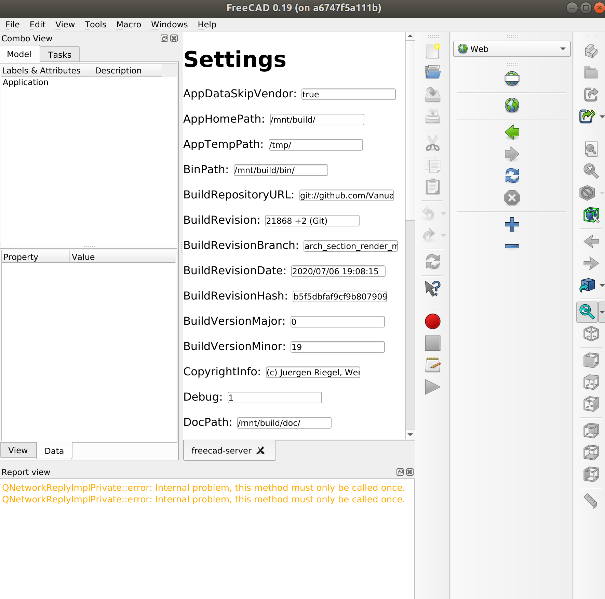

# FreeCAD JS

This is a POC for building FreeCAD UI interfaces in JS.

Tech stack: Graphene (GraphQL in Python), React (JS UI library)

## Setup

Install python dependencies for FreeCAD:

    pip3 install -r requirements.txt

Install JS dependencies and build

    yarn install
    yarn run build

## Run

Run server:

    FreeCADCmd src/Mod/JS/run_flask.py

Open server in the browser or in the FreeCAD Web workbench:

http://localhost:5000

